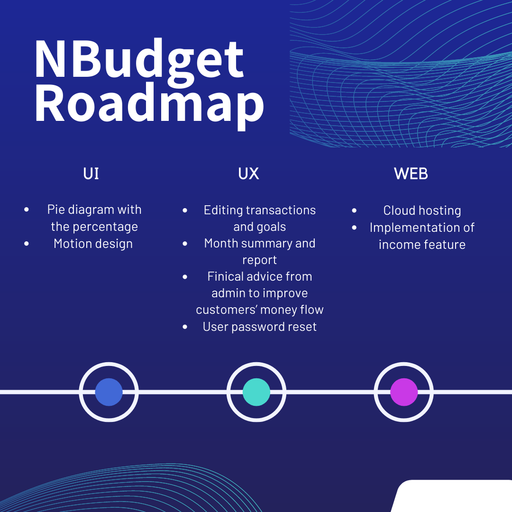

# NBudget

NBudget is a money-flow progressive web application with admin control panel.
This project was bootstrapped with [Create React App](https://github.com/facebook/create-react-app), Bootstrap, Node.js, Express and MongoDB.
NPM packages:

- bcrypt - password hashing
- joi, celebrate - server-side validation
- cors - cors
- ipFilter - filter for IPs

# Purpose

NBudget is a new user-friendly service that allows to control your budget. This control budget system collects information about users’ expenses and income and prepares a visual report and diagram for the user. The service is created to provide the best possible user experience for money management. It will be a mobile-friendly web app, which could be accessible at any time.

# Target Audience

This system is designed to supply financial observe and advice for those who desire to control their budget. The system allows users to add their expenses and savings. This allows users to visually estimate their budget and check categories that could be reduced or increased. Manual typing money amount in different categories gives a possibility to actually understand and think it over. Which makes users more conscious about money flow.

# Roadmap

<p align="center">
  
</p>

# Business Requirements

- 1 All users must be registered in the system.
- 2 Users will be able to add their expenses and savings goals in specific categories.
- 3 There is no limit number for categories of expenses savings.
- 4 Users cannot see other users' statistics and profiles.
- 5 Admin can view users list with statistics.
- 6 Admin sends financial advice to help to achieve users' savings goals.
- 7 All personal information should be secure
- 8 The service does not have access to a bank account.

## Usage

```
change config.env file in root folder
- create config.env
- add your MONGO_URI
```

```
 npm install
 cd frontend npm install
 cd ..

 # Run front and backend
 npm run dev

 # Backend only
 npm run server

 # Frontend only
 npm run frontend

 # Build client
 cd frontend
 npm run build

 # Prod
 npm start
```

### Deployment

https://nbudget-money-app.herokuapp.com
